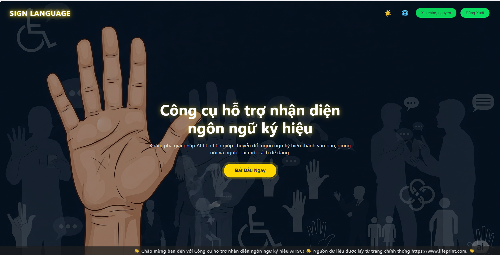

# 🚀 Project AIDEV - Công Cụ Hỗ Trợ Nhận Diện Ngôn Ngữ Ký Hiệu

## 📖 Giới Thiệu

**Project AIDEV** là một ứng dụng AI tiên tiến được thiết kế để hỗ trợ giao tiếp cho cộng đồng người khiếm thính và khiếm thị. Dự án tích hợp công nghệ nhận diện cử chỉ (gesture recognition), chuyển đổi văn bản thành giọng nói (Text-to-Speech), và chuyển đổi giọng nói thành văn bản (Speech-to-Text) để tạo ra một giải pháp giao tiếp toàn diện.

### 🎯 Mục Tiêu Dự Án

- **Hỗ trợ giao tiếp**: Giúp người khiếm thính giao tiếp với người nghe bình thường
- **Giáo dục**: Cung cấp công cụ học tập ngôn ngữ ký hiệu
- **Tích hợp AI**: Sử dụng các mô hình AI tiên tiến để cải thiện độ chính xác
- **Đa ngôn ngữ**: Hỗ trợ tiếng Việt và tiếng Anh
- **Giao diện thân thiện**: Thiết kế UI/UX dễ sử dụng cho mọi đối tượng

## ✨ Các Chức Năng Chính

### 🤖 Nhận Diện Cử Chỉ (Gesture Recognition)
- **YOLO Model**: Sử dụng mô hình YOLO được huấn luyện đặc biệt cho ngôn ngữ ký hiệu
- **19 Cử Chỉ Cơ Bản**: Nhận diện các ký hiệu như: hello, goodbye, thank you, yes, no, eat, drink, sleep, home, go, come, love, like, want, listen, read, book, bread, i, you
- **Real-time Processing**: Xử lý video theo thời gian thực với độ trễ thấp
- **Độ Chính Xác Cao**: Tích hợp với Gemini AI để cải thiện độ chính xác

### 🔊 Chuyển Đổi Văn Bản Thành Giọng Nói (Text-to-Speech)
- **ElevenLabs API**: Giọng nói tự nhiên, chất lượng cao
- **Google Cloud TTS**: Dự phòng khi ElevenLabs không khả dụng
- **Đa Giọng Nói**: Hỗ trợ giọng nam/nữ cho cả tiếng Việt và tiếng Anh
- **Tùy Chỉnh Tốc Độ**: Điều chỉnh tốc độ đọc theo nhu cầu

### 🎤 Chuyển Đổi Giọng Nói Thành Văn Bản (Speech-to-Text)
- **Google Cloud Speech**: API chính với độ chính xác cao
- **Đa Định Dạng**: Hỗ trợ WAV, MP3, OGG, WEBM, FLAC, M4A
- **Nhận Diện Ngôn Ngữ**: Tự động phát hiện tiếng Việt và tiếng Anh
- **Xử Lý Âm Thanh**: Tối ưu hóa âm thanh để cải thiện độ chính xác

### 🌐 Giao Diện Web
- **Responsive Design**: Tương thích với mọi thiết bị
- **Đa Ngôn Ngữ**: Giao diện tiếng Việt và tiếng Anh
- **Chế Độ Tối/Sáng**: Tùy chỉnh giao diện theo sở thích
- **Video Hướng Dẫn**: Tích hợp video demo và hướng dẫn sử dụng

## 🏗️ Kiến Trúc Hệ Thống


```
project_aidev/
├── backend/                 # Backend API (Flask)
│   ├── app.py              # API chính
│   ├── text_to_speech.py   # Dịch vụ TTS
│   ├── speech_to_text.py   # Dịch vụ STT
│   ├── best.pt            # Model YOLO
│   └── requirements.txt    # Dependencies
├── Front_End/              # Frontend (HTML/CSS/JS)
│   ├── index.html         # Trang chủ
│   ├── styles.css         # CSS styles
│   └── script.js          # JavaScript logic
├── Image/                  # Hình ảnh và icons
├── Video/                  # Video demo và hướng dẫn
└── README.md              # Tài liệu dự án
```

## 🚀 Cách Cài Đặt Và Chạy Dự Án

### 📋 Yêu Cầu Hệ Thống

- **Python**: 3.8 trở lên
- **RAM**: Tối thiểu 4GB (khuyến nghị 8GB+)
- **GPU**: Khuyến nghị có GPU để tăng tốc YOLO model
- **Hệ điều hành**: Windows, macOS, hoặc Linux

### 🔧 Cài Đặt Backend

1. **Clone dự án**:
```bash
git clone <repository-url>
cd project_aidev/backend
```

2. **Tạo môi trường ảo**:
```bash
python -m venv venv
# Windows
venv\Scripts\activate
# macOS/Linux
source venv/bin/activate
```

3. **Cài đặt dependencies**:
```bash
pip install -r requirements.txt
```

4. **Cài đặt FFmpeg** (cho xử lý âm thanh):
```bash
# Windows (với Chocolatey)
choco install ffmpeg

# macOS (với Homebrew)
brew install ffmpeg

# Ubuntu/Debian
sudo apt install ffmpeg
```

### ⚙️ Cấu Hình Môi Trường

Tạo file `.env` trong thư mục `backend/`:

```env
# Google Cloud APIs
GOOGLE_API_KEY=your_google_api_key_here
GOOGLE_APPLICATION_CREDENTIALS=path/to/service-account.json
GOOGLE_SERVICE_ACCOUNT_JSON={"type": "service_account", ...}

# ElevenLabs API (nhiều keys để tăng giới hạn)
ELEVENLABS_API_KEY_1=your_first_elevenlabs_key
ELEVENLABS_API_KEY_2=your_second_elevenlabs_key
ELEVENLABS_API_KEY_3=your_third_elevenlabs_key

# Gemini AI
GEMINI_API_KEY=your_gemini_api_key

# Cấu hình hệ thống
DEBUG=True
PORT=5000
HOST=0.0.0.0
```

### 🚀 Chạy Backend

```bash
cd backend
python app.py
```

Backend sẽ chạy tại: `http://localhost:5000`

### 🌐 Chạy Frontend

Mở file `Front_End/index.html` trong trình duyệt web hoặc sử dụng local server:

```bash
cd Front_End
python -m http.server 8000
```

Frontend sẽ chạy tại: `http://localhost:8000`

## 🔌 API Endpoints

### 📡 Endpoints Chính

#### 1. Kiểm Tra Sức Khỏe Hệ Thống
```http
GET /
```
**Response:**
```json
{
  "status": "running",
  "message": "Sign Language Backend API",
  "version": "1.3.0",
  "available_engines": {
    "tts": ["elevenlabs", "google", "gtts", "pyttsx3"],
    "stt": ["google_cloud", "speech_recognition"]
  }
}
```

#### 2. Chuyển Văn Bản Thành Giọng Nói
```http
POST /api/text-to-speech
```
**Body:**
```json
{
  "text": "Xin chào, tôi là người khiếm thính",
  "language": "vi",
  "voice_type": "female",
  "voice_name": "Như",
  "speed": 1.0
}
```

#### 3. Chuyển Giọng Nói Thành Văn Bản
```http
POST /api/speech-to-text
```
**Body:** Form data với file audio
**Parameters:**
- `audio_file`: File âm thanh (WAV, MP3, OGG, etc.)
- `language`: "vi" hoặc "en"

#### 4. Nhận Diện Cử Chỉ
```http
POST /api/gesture-recognition
```
**Body:** Form data với file video hoặc image
**Parameters:**
- `media_file`: File video hoặc hình ảnh
- `confidence_threshold`: Ngưỡng tin cậy (0.0 - 1.0)

#### 5. Lấy Danh Sách Giọng Nói
```http
GET /api/voices
```
**Response:**
```json
{
  "vi": {
    "female": ["Như", "Hà My"],
    "male": ["Việt Dũng", "Ly Hai"]
  },
  "en": {
    "female": ["Natasha", "Christina"],
    "male": ["Adam", "Jon"]
  }
}
```

## ?? Cách Sử Dụng

### 1. **Nhận Diện Cử Chỉ**
- Mở camera hoặc tải video lên
- Thực hiện cử chỉ ngôn ngữ ký hiệu
- Hệ thống sẽ nhận diện và hiển thị kết quả
- Có thể chuyển đổi kết quả thành giọng nói

### 2. **Chuyển Văn Bản Thành Giọng Nói**
- Nhập văn bản cần chuyển đổi
- Chọn ngôn ngữ và giọng đọc
- Điều chỉnh tốc độ nếu cần
- Nhấn "Chuyển đổi" để tạo giọng nói

### 3. **Chuyển Giọng Nói Thành Văn Bản**
- Ghi âm hoặc tải file âm thanh
- Chọn ngôn ngữ
- Hệ thống sẽ chuyển đổi và hiển thị văn bản

## 🔑 API Keys Cần Thiết

### 1. **Google Cloud APIs**
- **Text-to-Speech API**: Chuyển văn bản thành giọng nói
- **Speech-to-Text API**: Chuyển giọng nói thành văn bản
- **Gemini AI API**: Cải thiện độ chính xác nhận diện

### 2. **ElevenLabs API**
- **Text-to-Speech**: Giọng nói tự nhiên, chất lượng cao
- **Hỗ trợ đa ngôn ngữ**: Tiếng Việt và tiếng Anh

### 3. **Cách Lấy API Keys**

#### Google Cloud:
1. Truy cập [Google Cloud Console](https://console.cloud.google.com/)
2. Tạo project mới hoặc chọn project có sẵn
3. Bật các API: Text-to-Speech, Speech-to-Text
4. Tạo Service Account và download JSON credentials
5. Cấp quyền cho Service Account

#### ElevenLabs:
1. Truy cập [ElevenLabs](https://elevenlabs.io/)
2. Đăng ký tài khoản miễn phí
3. Lấy API key từ dashboard
4. Nâng cấp plan để tăng giới hạn sử dụng

#### Gemini AI:
1. Truy cập [Google AI Studio](https://aistudio.google.com/)
2. Tạo API key mới
3. Copy key vào file .env

## 🐛 Xử Lý Lỗi Thường Gặp

### 1. **Lỗi YOLO Model**
```bash
# Nếu không thể tải model, hệ thống sẽ sử dụng Mock model
# Kiểm tra đường dẫn file best.pt trong app.py
```

### 2. **Lỗi Audio Processing**
```bash
# Cài đặt FFmpeg
# Kiểm tra quyền truy cập thư mục temp/
```

### 3. **Lỗi API Keys**
```bash
# Kiểm tra file .env
# Xác nhận API keys có hiệu lực
# Kiểm tra giới hạn sử dụng API
```

## 📊 Hiệu Suất Và Tối Ưu Hóa

### 🚀 Tối Ưu Hóa Backend
- **Caching**: Cache kết quả nhận diện để giảm thời gian xử lý
- **Async Processing**: Xử lý bất đồng bộ cho các tác vụ nặng
- **Model Optimization**: Sử dụng YOLO model được tối ưu hóa

### 🎨 Tối Ưu Hóa Frontend
- **Lazy Loading**: Tải video và hình ảnh theo nhu cầu
- **Responsive Images**: Tối ưu hóa hình ảnh cho các thiết bị khác nhau
- **Progressive Enhancement**: Tăng cường trải nghiệm người dùng

## 🤝 Đóng Góp

Chúng tôi hoan nghênh mọi đóng góp từ cộng đồng! Để đóng góp:

1. **Fork** dự án
2. Tạo **feature branch** (`git checkout -b feature/AmazingFeature`)
3. **Commit** thay đổi (`git commit -m 'Add some AmazingFeature'`)
4. **Push** lên branch (`git push origin feature/AmazingFeature`)
5. Tạo **Pull Request**

## 📄 Giấy Phép

Dự án này được phân phối dưới giấy phép MIT. Xem file `LICENSE` để biết thêm chi tiết.

## 📞 Liên Hệ

- **Email**: nguyenleanhduy9412@gmail.com
- **GitHub**: https://github.com/iamjuly205


## 🙏 Lời Cảm Ơn

- **Google Cloud** - Cung cấp các API AI mạnh mẽ
- **ElevenLabs** - Giọng nói tự nhiên chất lượng cao
- **Ultralytics** - Framework YOLO hiệu quả
- **Cộng đồng mã nguồn mở** - Những đóng góp quý báu

---

**⭐ Nếu dự án này hữu ích, hãy cho chúng tôi một ngôi sao trên GitHub!**

**🔄 Cập nhật lần cuối**: Tháng 12, 2024
**📱 Phiên bản**: 1.3.0
**🐍 Python**: 3.8+
**🌐 Framework**: Flask + HTML/CSS/JS 
